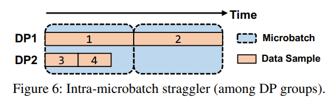
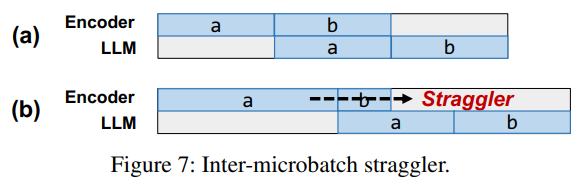
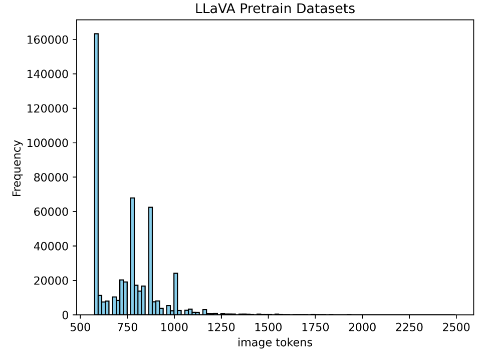
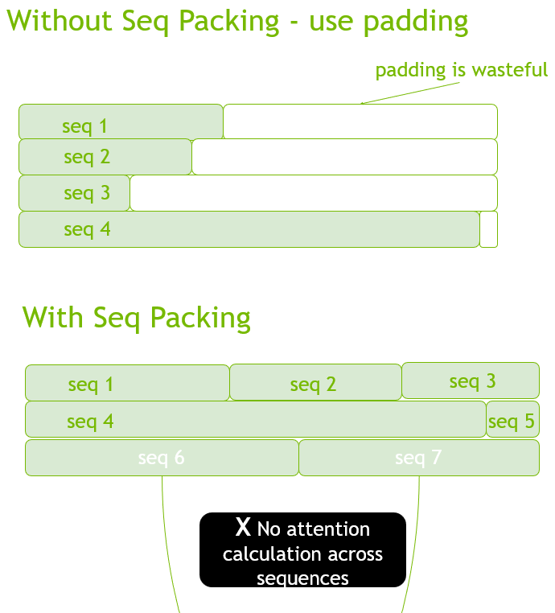
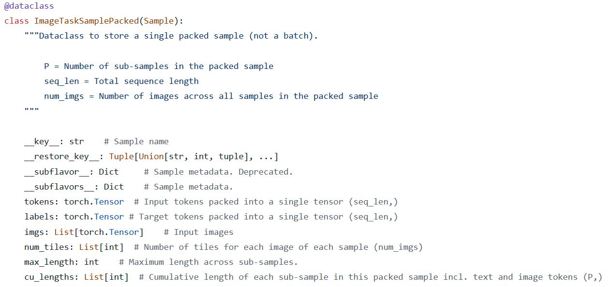
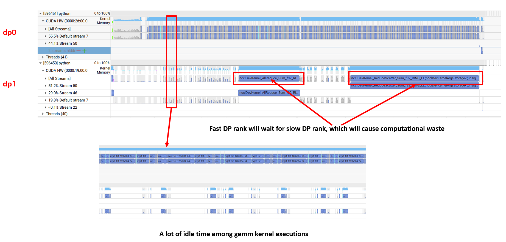

# Data Imbalanced

  

## 1.数据不均衡的场景 

### 数据不均衡
1. 同一mbs内部，不同的数据并行组，由于输入数据（images/videos/text）的不均衡导致计算的不均衡：Ref: [DistTrain](https://arxiv.org/abs/2408.04275)
   
    

2. 不同的mbs之间，由于数据的不均衡，造成pipeline的bubble，从而降低训练效率；

## 2.数据

### 具体数据分析

以常用的[LLaVA-Pretrain-Dataset](https://huggingface.co/datasets/liuhaotian/LLaVA-Pretrain)为例，分析一下`Images`数据的不均衡现象。`Images`会经过`ImageEncoder`编码得到`Image tokens`。如果在Encode过程中，保留图像的原始分辨率（不resize成统一的分辨率），那么不同分辨率的图像，经过`ImageEncoder`编码之后会得到不同数量的`Image tokens`，$N_{\text{image-tokens}}=\lceil{w//p}\rceil*\lceil{h//p}\rceil$。这里$w$,$h$分别是输入图像的宽高，$p$是patch size。先从`Image tokens`看一下不同分辨率图像带来的不均衡。

参考：[LLavaDatasetAnalysis.ipynb](./LLavaDatasetAnalysis.ipynb)

1. image tokens数量小于2500的数据分布如图：
   
2. image tokens超过3000的case有180例，占总体数据量的不足0.05%
3. image tokens数量在500-1500之间的占比99.4%

  

## 数据不均衡的解决方案——Sequence Packing

Sequence Packing的原理如下图所示：

 

## mcore实现

Ref: [dataset_helpers.py](https://github.com/NVIDIA/Megatron-LM/blob/4429e8ebe21fb011529d7401c370841ce530785a/examples/multimodal/dataset_helpers.py#L49)

### 随机数据做Sequence Packing

### Sequence Packing之前先做预处理

### 参数选取

 

## 试验

### 试验1：单卡H20

* H20 96G, single GPU
* image_tiles: 1-20, images tokens: 256-5120
  
|packing sequence| time per sample (ms)|buffer size|packing sequence length|sequence length|
|:--------------:|:-------------------:|:---------:|:---------------------:|:-------------:|
|disabled|1585.5|100|8k|8k|
|enabled |1007.5|100|8k|8k|

**speedup: 57.4%**

 

### 试验2：2卡H20, TP1PP1DP2, 模拟：同一mbs内部，不同的数据并行组，由于输入数据（images/videos/text）的不均衡导致计算的不均衡
* H20 96G, 2GPUs
* image_tiles: 1-20, images tokens: 256-5120

|packing sequence| time per sample (ms)|buffer size|packing sequence length|sequence length|
|:--------------:|:-------------------:|:---------:|:---------------------:|:-------------:|
|disabled|817.1|100|8k|8k|
|enabled |532.2|100|8k|8k|

**speedup: 53.5%**

* 下图：为了更明显的看出**intra mbs**的数据不均衡场景对训练效率的影响，将两个数据并行组的数据设计的极不均衡，如DP1上的数据为2 image tiles (256 image tokens), DP0上的数据为20 image tiles。从下面的timeline可以看出：
    1. DP1的训练执行很快，大量的时间在等待DP0执行，通讯等待浪费了大量时间；
    2. DP1上gemm kernel的执行间隔有大量的空闲，执行效率低下；
   
        **DP0, 20 image tiles, DP1, 2 image tiles: no sequence packing**
        

* 作为对比，当开启了sequence packing，如下图是一个实际数据运行的例子：
    1. 两个DP通信组的负载相对更均衡，虽然无法做到完全均衡，但是与上述试验对比，两个DP rank之间的通信等待时间明显更少；
    2. gemm kernel的利用率更高，对比上述试验，gemm kernel之间不在有大量的空白；
    

  

****

# 参考资料
1. [Sequence Packing](https://docs.nvidia.com/nemo-framework/user-guide/24.12/nemotoolkit/features/optimizations/sequence_packing.html)
2. [Sequence Packing for NeVA](https://docs.nvidia.com/nemo-framework/user-guide/24.12/nemotoolkit/multimodal/mllm/sequence_packing.html)
3. [DistTrain: Addressing Model and Data Heterogeneity with Disaggregated Training for Multimodal Large Language Models](https://arxiv.org/abs/2408.04275)
4. [OmniBal: Towards Fast Instruct-tuning for Vision-Language Models via Omniverse Computation Balance](https://arxiv.org/abs/2407.20761)
